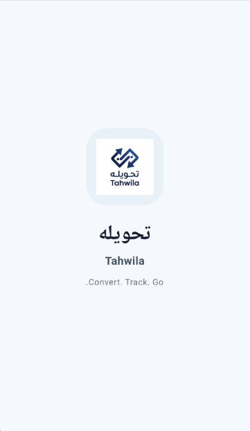
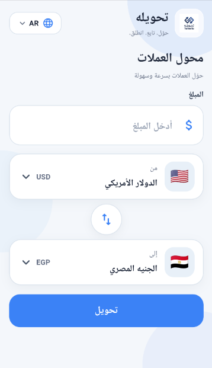
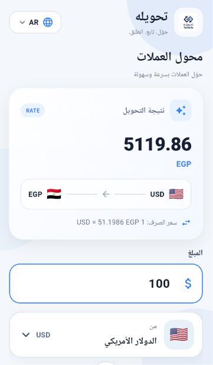
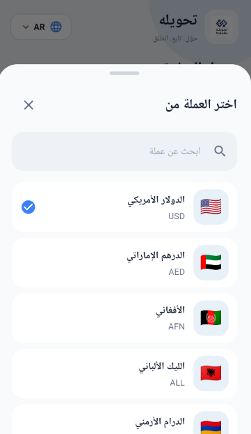

# 💱 Tahwila | تحويله

**Tahwila** is a professional Flutter currency converter application built to demonstrate real-world Flutter development practices, clean code, and scalable project structure.

The app uses **ExchangeRate-API** to fetch currency exchange rates and provides a simple, responsive, and user-friendly interface for converting between currencies.

---

## 📱 App Preview

| Logo | Splash | Home |
|---|---|---|
|  |  |  |

| Conversion | Search |
|---|---|
|  |  |

---

## ✨ Features

- 💱 Currency conversion
- 🌍 Multiple currencies
- 🇪🇬 Arabic and 🇬🇧 English localization
- 🔎 Currency search
- 🔄 Swap source and target currencies
- 📊 Display exchange rate
- 🕐 Display last update information
- 🌐 API integration using Dio
- ⚡ State management with Cubit
- 🧱 Clean Architecture
- 📦 Repository Pattern
- 🎯 Use Case Pattern
- 💉 Dependency Injection with GetIt
- 💾 Save selected language using SharedPreferences
- 📱 Responsive UI using Flutter ScreenUtil
- ❌ Network and server error handling
- 🎨 Clean and modern user interface
- 🚀 Ready for Android APK build

---

## 🛠 Technologies

| Technology | Usage |
|---|---|
| Flutter | Application development |
| Dart | Programming language |
| Dio | HTTP/API requests |
| Flutter Bloc | State management |
| Cubit | Business logic/state management |
| GetIt | Dependency Injection |
| SharedPreferences | Local language preference |
| Flutter ScreenUtil | Responsive UI |
| ExchangeRate-API | Currency exchange rates |

---

## 🏗 Architecture

Tahwila follows **Clean Architecture** to separate responsibilities and make the project easier to maintain, test, and extend.

```text
Presentation
     ↓
   UseCases
     ↓
 Repository
     ↓
 DataSource
     ↓
    API
```

The project is divided into three main layers:

```text
Presentation
     │
     ├── Screens
     ├── Widgets
     └── Cubit
     
Domain
     │
     ├── Entities
     ├── Repository Contracts
     └── Use Cases
     
Data
     │
     ├── Models
     ├── Remote Data Sources
     └── Repository Implementation
```

---

## 📂 Project Structure

```text
lib/
├── main.dart
│
├── core/
│   ├── constants/
│   │   ├── api_constants.dart
│   │   ├── currency_flags.dart
│   │   └── currency_names.dart
│   │
│   ├── errors/
│   │   ├── exceptions.dart
│   │   └── failures.dart
│   │
│   ├── network/
│   │
│   ├── di/
│   │   └── service_locator.dart
│   │
│   └── localization/
│       ├── app_localizations.dart
│       ├── ar.dart
│       ├── en.dart
│       └── language_cubit.dart
│
└── features/
    └── currency_converter/
        ├── data/
        │   ├── datasources/
        │   │   └── remote_data_source.dart
        │   ├── models/
        │   │   └── currency_model.dart
        │   └── repo/
        │       └── currency_repository_impl.dart
        │
        ├── domain/
        │   ├── entities/
        │   │   └── currency.dart
        │   ├── repo/
        │   │   └── currency_repository.dart
        │   └── usecases/
        │       ├── convert_currency.dart
        │       └── get_currencies.dart
        │
        └── presentation/
            ├── cubit/
            │   ├── currency_cubit.dart
            │   └── currency_state.dart
            │
            ├── screens/
            │   ├── splash_screen.dart
            │   └── currency_screen.dart
            │
            └── widgets/
                ├── amount_field.dart
                ├── background_decoration.dart
                ├── convert_button.dart
                ├── currency_content.dart
                ├── currency_header.dart
                ├── currency_picker.dart
                ├── currency_selector.dart
                ├── error_view.dart
                ├── language_button.dart
                ├── result_card.dart
                └── swap_button.dart

assets/
└── logo.png

screenshots/
├── logo.png
├── splash.png
├── home.png
├── convert.png
└── search.png
```

---

# 🔌 API Integration

Tahwila uses **ExchangeRate-API** to retrieve exchange rates.

The application requests the latest rates using a base currency:

```text
GET /v6/YOUR_API_KEY/latest/USD
```

Example response:

```json
{
  "result": "success",
  "base_code": "USD",
  "conversion_rates": {
    "USD": 1,
    "EUR": 0.8596,
    "GBP": 0.7380,
    "EGP": 51.1986
  }
}
```

The application reads the `conversion_rates` map and converts it into a list of currency models.

---

# 🔄 API Request Flow

```text
CurrencyCubit
      ↓
GetCurrencies Use Case
      ↓
CurrencyRepository
      ↓
CurrencyRepositoryImpl
      ↓
CurrencyRemoteDataSource
      ↓
Dio
      ↓
ExchangeRate-API
      ↓
JSON Response
      ↓
CurrencyModel
      ↓
Currency Entity
      ↓
CurrencyCubit
      ↓
UI
```

---

# 💰 Currency Conversion

The application converts currencies using the following formula:

```text
result =
(amount / fromCurrency.rate) * toCurrency.rate
```

### Example

If:

```text
1 USD = 51.1986 EGP
```

Then:

```text
100 USD × 51.1986 = 5119.86 EGP
```

For currencies with USD as the API base:

```text
Amount
   ↓
From Currency Rate
   ↓
USD Base Value
   ↓
Target Currency Rate
   ↓
Final Result
```

The conversion logic is isolated inside the:

```text
ConvertCurrency
```

Use Case.

---

# 🔄 Swap Currencies

The swap feature exchanges:

```text
From Currency
      ↕
To Currency
```

Example:

```text
USD → EGP
```

becomes:

```text
EGP → USD
```

The swap operation is handled by `CurrencyCubit`, while the UI only triggers the action.

---

# 🔎 Currency Search

The currency picker provides local search.

The user can search using:

```text
Currency Code
```

or:

```text
Arabic Currency Name
```

Example:

```text
EGP
جنيه مصري
```

The search is performed locally after currencies are loaded from the API.

---

# 🌍 Localization

Tahwila supports:

- 🇪🇬 Arabic
- 🇬🇧 English

Localization is implemented using Flutter's localization system.

```text
LanguageCubit
      ↓
SharedPreferences
      ↓
Saved Language
      ↓
MaterialApp Locale
      ↓
AppLocalizations
      ↓
UI
```

The selected language is stored locally using:

```text
SharedPreferences
```

so the application remembers the user's language preference after restarting.

Currency names remain available in Arabic for the currency picker while the main application interface can switch between Arabic and English.

---

# ⚡ State Management

The project uses **Cubit** from Flutter Bloc.

Main states:

```text
CurrencyInitial
       ↓
CurrencyLoading
       ↓
CurrencySuccess
       ↓
CurrencyError
```

### CurrencyInitial

Initial state before data loading.

### CurrencyLoading

Displayed while requesting currency data.

### CurrencySuccess

Contains:

- Currency list
- Selected source currency
- Selected target currency
- Conversion result

### CurrencyError

Contains a localized error message.

---

# 🧱 Repository Pattern

The Repository Pattern separates business logic from data sources.

```text
Domain
   │
   ▼
CurrencyRepository
   │
   ▼
CurrencyRepositoryImpl
   │
   ▼
CurrencyRemoteDataSource
```

The Domain layer depends on an abstraction:

```dart
abstract class CurrencyRepository {
  Future<List<Currency>> getCurrencies();
}
```

The Data layer provides the implementation.

This makes the application easier to:

- Test
- Maintain
- Extend
- Replace the API
- Add another data source later

---

# 🎯 Use Case Pattern

Business operations are represented using dedicated Use Cases.

Current Use Cases:

```text
GetCurrencies
ConvertCurrency
```

### GetCurrencies

Responsible for requesting the available currencies.

### ConvertCurrency

Responsible for performing the conversion calculation.

This keeps business rules outside the UI.

---

# 💉 Dependency Injection

The project uses **GetIt** for Dependency Injection.

Main dependencies include:

```text
Dio
CurrencyRemoteDataSource
CurrencyRepository
GetCurrencies
ConvertCurrency
CurrencyCubit
```

Dependency flow:

```text
GetIt
 │
 ├── Dio
 │
 ├── RemoteDataSource
 │
 ├── Repository
 │
 ├── GetCurrencies
 │
 ├── ConvertCurrency
 │
 └── CurrencyCubit
```

This reduces tight coupling and makes dependencies easier to manage and test.

---

# 🧠 SOLID Principles

The project follows the main SOLID principles.

## S — Single Responsibility

Each class has one main responsibility.

Examples:

```text
CurrencyRemoteDataSource
→ API communication

CurrencyRepositoryImpl
→ Repository implementation

ConvertCurrency
→ Conversion calculation

CurrencyCubit
→ State management
```

## O — Open/Closed Principle

The project is structured so components can be extended without heavily modifying existing business logic.

For example, another data source can be introduced through the repository abstraction.

## L — Liskov Substitution Principle

Concrete implementations can be used through their abstractions.

```text
CurrencyRepository
        ↑
        │
CurrencyRepositoryImpl
```

## I — Interface Segregation Principle

The project uses focused abstractions rather than large interfaces.

## D — Dependency Inversion Principle

Higher-level business logic depends on abstractions instead of concrete data sources.

```text
Domain
  ↓
Abstraction
  ↑
Data Implementation
```

---

# 📡 Error Handling

The application separates exceptions from failures.

### Exceptions

```text
ServerException
NetworkException
```

### Failures

```text
ServerFailure
NetworkFailure
```

Example flow:

```text
Dio Exception
      ↓
Remote Data Source
      ↓
Exception
      ↓
Repository
      ↓
Failure
      ↓
Cubit
      ↓
Localized Error
      ↓
Error View
```

This keeps API-related errors separated from presentation logic.

---

# 📱 Responsive UI

The application uses:

```text
flutter_screenutil
```

with:

```dart
designSize: Size(360, 690)
```

and:

```dart
minTextAdapt: true
splitScreenMode: true
```

This helps the UI adapt to different screen sizes while maintaining consistent proportions.

---

# 🎨 UI

Tahwila was designed with a clean and modern interface focused on usability.

Main UI components include:

- App header
- Language selector
- Amount input
- Currency selectors
- Currency picker
- Swap button
- Convert button
- Conversion result card
- Error state
- Loading state

The interface is designed to remain simple without unnecessary visual complexity.

---

# 📦 Packages

Main packages used in the project:

```yaml
dio: ^5.11.1
flutter_bloc: ^9.1.1
get_it: ^9.2.1
flutter_screenutil: ^5.9.3
shared_preferences: ^2.5.5
```

Flutter localization packages are provided through the Flutter SDK.

---

# 🔐 Security Note

The ExchangeRate-API key is required to access the API.

For development, the key is stored in the project's API constants.

For a production application, the API key should not be exposed directly inside a mobile application.

Recommended production approach:

```text
Flutter App
     ↓
Backend
     ↓
ExchangeRate-API
```

**Never publish a real private API key inside a public GitHub repository.**

---

# ⏱ Exchange Rate Update

Tahwila uses ExchangeRate-API to retrieve exchange-rate data.

The API used by this project is **not a real-time streaming financial market feed**.

Exchange-rate data is updated according to the service's available update schedule.

Therefore, the displayed rate should be treated as the latest rate returned by the API, not as a continuously updating market price.

---

# 🚀 Getting Started

## 1. Clone the repository

```bash
git clone YOUR_GITHUB_REPOSITORY_URL
```

## 2. Enter the project

```bash
cd currency_converter
```

## 3. Install dependencies

```bash
flutter pub get
```

## 4. Add your API key

Open:

```text
lib/core/constants/api_constants.dart
```

and configure your ExchangeRate-API key.

**Do not publish the real key to GitHub.**

## 5. Run the application

```bash
flutter run
```

---

# 📦 Build APK

To create a release APK:

```bash
flutter build apk --release
```

The generated APK can be found under:

```text
build/app/outputs/flutter-apk/app-release.apk
```

---

# 🧪 Testing

Run Flutter tests using:

```bash
flutter test
```

Analyze the project using:

```bash
flutter analyze
```

---

# 🔮 Future Improvements

Possible future improvements include:

- 📈 Historical exchange-rate charts
- ⭐ Favorite currencies
- 🕘 Conversion history
- 💾 Offline cached rates
- 🔔 Rate change notifications
- 📊 More detailed currency statistics
- 🌐 Backend integration for API-key protection
- 🔐 Secure production configuration
- 🧪 More unit and widget tests
- 📱 App Store / Google Play release
- 🧾 Conversion history export

---

# 🎓 What This Project Demonstrates

Tahwila demonstrates practical experience with:

```text
Flutter
Dart
Dio
REST APIs
Cubit
Clean Architecture
SOLID
Repository Pattern
Use Cases
Dependency Injection
GetIt
SharedPreferences
Localization
Responsive UI
Error Handling
Git & GitHub
```

The goal was not only to build a currency converter, but to apply professional Flutter development practices in a real project.

---

# 👨‍💻 Developer

## Eng Mohamed Waleed

**Flutter Developer | AI Engineer**

**Technology • AI • Software Solutions**

---

# 📄 License

This project is licensed under the MIT License.

You are free to use, modify, and distribute the project according to the terms of the license.

---

<div align="center">

### 💱 Tahwila | تحويله

**Convert. Track. Go.**

</div>